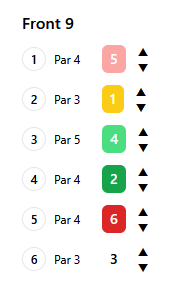
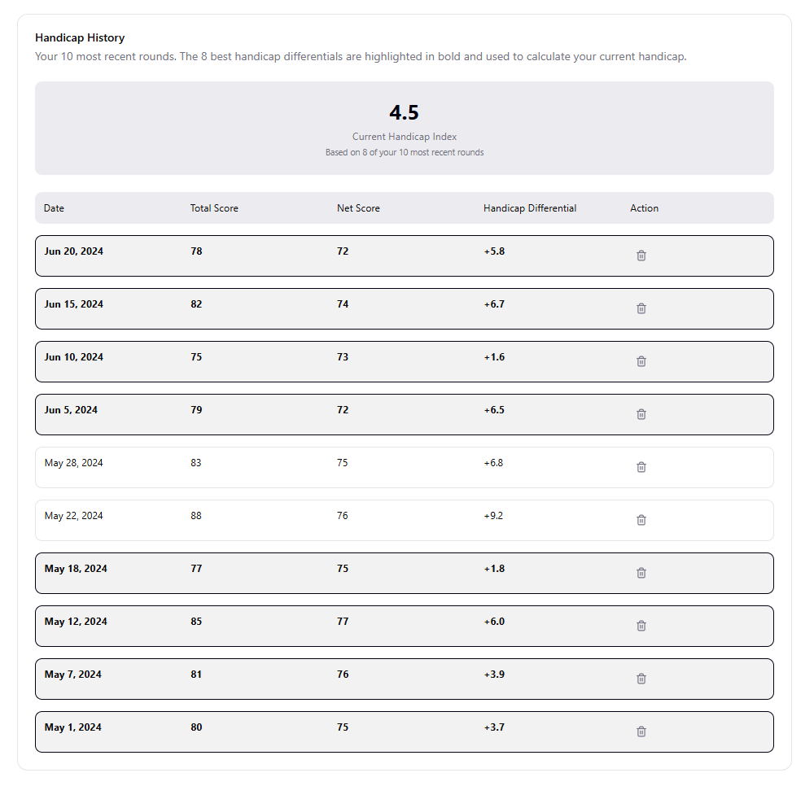

# Full Stack Developer Skill Assessment
### Quanos Solutions GmbH, 2025 


#### General Hints
- The assessement refers to terminology of a domain you may not be familiar with. Please make sure to read the instructions and the explanations carefully. 
- Keep in mind that the required functionalities are described in an order defined by the Product Owner, which is not necessarily the same order in which the implementation takes place.
- The requirements are described in the best possible way. But this doesn't mean that you need not be vigilant when it comes to the details. Maybe you will identify improvements that for example prevent users from using the application in a wrong way. Maybe the requirement descriptions do not cover error handling. As a software professional you fill in these gaps. 
- The backend MUST be implemented in C#, the frontend MUST be implemented using React. The GraphQL interface MUST be used. Apart from that, you may use any library of your choice. You may also refactor the code if you think this will improve code quality. 
- You are entitled to use an AI assistant of your choice. At Quanos we believe that AI makes great developers even more productive. But: developers must keep control of the generated code and make sure it follows best practices. 
- If you have questions, please contact Jörg Arrenberg (joerg.arrenberg@quanos.com)

## Golf Score Tracker
In this lab you will extend a web application that can be used by golfers to track their scores. You will be asked to add functionality that will require changes in the frontend and the backend and it is up to you to take a concious decision where to put the required business logic. 
You will have to make yourself familiar with the terminology and regulations of golf.

### Where do you start?
You will be provided with a backend (folder 'Golf.Backend') and a frontend (folder 'Golf.Frontend')

To run the backend: 
```
cd .\Golf.Backend
dotnet run
```

To run the frontend: 
```
cd .\Golf.Frontend
npm install       // only once
npm run dev
```
When both backend and frontend are running, direct your browser to http://localhost:5173/

#### Authentication
This lab leaves out state of the art authentication, but user identification is mandatory though. Hence, the application includes a very simple authentication system without data persistence. You may leave it that way. 

#### Overview of the application
The application shall implement two use cases: 

1. Entering a score after a round of golf to calculate some values that are very important for golfers.
2. Tracking some of these numbers which are the foundation to calculate a golfer's handicap index - for some amateur golfers the handicap index is the most important performance indicator. 

You can switch between these use cases using the slider button. 

The page for entering a score shows what golfers call a score card. The central elements of a score card are the 18 input fields to enter the number of strokes it took a golfer to put the ball in the hole. When you enter numbers you will see, that the total score (at the bottom) sums up all strokes. Most other elements on the page do not have a function for now - it will be your task to add the missing features. 

Handicap TBD

### The Requirements

#### Req. 1-1 "Color coding of a hole's score"
Adding colors to the score card will give a visual impression of how good the round of golf was. 
Each hole on the course has a designated score that is used to indicate the difficulty. This designated score is called 'Par'. Pars range from 3-5 normally. When a golfer needs more strokes than Par it is called a bogey (+1), double bogey (+2), triple bogey (+3) and so on. When a golfer needs less strokes than Par, it is called a birdie (-1), eagle (-2) or albatros (-3). Sometimes golfers hit an ace or hole-in-one meaning that they need only one single shot. Usually that happens only on Par 3s, very very rare on Par 4s, and on Par 5s it is technical impossible. 

The Par for each hole is shown on the score card. Your task is to add color coding to the score card like shown in this picture: 



A birdie and a bogey shall be indicated using light green and light red. Any score better than a birdie should be indicated using green. An ace is yellow. Everything higher than bogey shall be red. A Par or a missing value shall have no color coding. 

#### Req 1-2 "Add choice of gender"
Please add a field "Gender" between "Player Name" and "Course Name". The field can have the values "male" or "female".


#### Req 1-3 "Retrieve golf course data from an API"
Of course not every golf course has the same sequence of Par definitions. Further, on the top of the page you see two values "Course Rating" and "Slope Rating", which are both important key figures when it comes to the further processing of a round's score. 
As golfers play different courses from time to time the score card must be flexible and adjust to data of a specific golf course. 

Please get yourself access to https://golfcourseapi.com/ (it's free) and read the API documentation. 

* Add a search function to the page. The user must be able to search for a golf course by name. (Hint: the API does not cover all golf courses of the world, but a search for 'pebble beach', 'trump' (yeah, that one ;)), 'pinehurst', 'muirfield' will give you results)
* When the user selects one golf course the application should adopt the data retrieved (i.e. Pars, Slope Rating, Course Rating)
* Not to be implemented: this API has limitations depending on the subscription plan to choose. Please think about things you could do to mitigate the risk of these limitations affecting the user experience. Please write down your ideas as comments in the code.

(Hint: Some golf courses have different spots (tees) from where to hit the first shot which allows for e.g. shorter distances in total for elderly golfers. The different tees of a golf course have names like "yellow", "silver" or something like that. To keep things a bit more simple, you may select just the first tee of the list returned by the API)

#### Req 1-4 "Hole Handicaps"
Looking into the data retrieved from https://golfcourseapi.com/ you will see that each hole not only has a Par value assigned, but also a property 'handicap'. This handicap value represents an order of holes starting with the most difficult one (handicap 1) and ending with the easiest one (handicap 18)
Extend the scorecard so that it shows the handicap value for each hole on the right side of the Par value (e.g. "Par 4 / Hcp 3")

#### Req 1-5 "Gross Score"
The Gross Score is calculated when a golf tournament uses the so-called Stableford method for counting strokes. This method is often used for amateur tournaments and offers the possibility to cancel a hole when the golfer has lost all chances for a good score on that hole. By cancelling, the pace of play can be kept high as otherwise everyone else would have to wait for the poor player to play until the bitter end. 
So here is how it works: you get points according to the result you achieve.

| Result | Points |
| ----------- | ----------- |
| Double Bogey (or more) | 	0 Points |
| Bogey	| 1 Point |
| Par	| 2 Points |
| Birdie	| 3 Points |
| Eagle 	| 4 Points |
| Albatross	| 5 Points |

If a golfer has alreay made as many strokes as would result in a double bogey, he can cancel the hole, just write down the double bogey on the score card and proceed to the next hole. 

Please implement this logic, so that "Gross Score" on the score card shows the points the golfer achieved. 

#### Req 1-6 "Net Score" 
Let's make it a little more complicated, shall we? ;) 

You propably heard that golfers have something called a 'handicap' or a 'handicap index'. This number allows to compare the skill level of a golfer to other golfer's skill level. The lower the handicap, the better the golfer. The handicap index is a decimal number with one decimal place. Very skilled golfers even have a negative handicap index. The maximum value is 54.0. The handicap index can be entered in the upper right corner of the page. 

When amateurs of different skill levels play a tournament together, they use the so-called "Net Score" which is a variant of Stableford (see Req 1-5) that reflects the individual handicap of the player. In order to calculate the points for a hole additional strokes will be added to the Par value. Here is how it goes: 

* the handicap index of the golfer is rounded to the next integer which gives the number of additional strokes for the course. 
* these additional strokes are distributed on the holes of the course following the order given by handicap numbers for each hole (see Req 1-4)
* Example 1: Handicap Index 3.4 --> Additional Strokes 3 --> On the holes attributed with handicap values 1 through 3 the golfer is granted an additional stroke
* Example 2: Handicap Index 20.7 --> Additional Strokes 21 --> On each hole the golfer is granted an additional stroke, on the holes attributed with handicap values 1 through 3 the golfer is granted another additional stroke resulting in two additional strokes on the three most difficult holes
* Example 3: Handicap Index 54.0 (the maximum) --> three additional strokes on each hole

Please implement: 
* Indicate the number of additional strokes a player gets for each hole by adding slashes behind the Par and Hcp label. For example two additional strokes would result in "Par 4 / Hcp 3    //"
* Calculate the "Net Score" by following the rules given in Req 1-5 with a slight deviation: you take into account the additional strokes in order to determine wether the golfer made Par or Bogey or Birdie ...
* Example 1: A golfer has 6 strokes on a Par 4 where he has two additional strokes. So for his skill level 6 strokes equal a Par and he gets two points
* Example 2: A golfer has strokes on a Par 5 where she has three additional strokes. For her skill level a Par on that hole would be 5+3=8, so the 7 strokes equal a birdie and she gets 3 points
* Example 3: A golfer has 5 strokes on a Par 3 with no additional strokes. In this case Gross result equals Net result which is a Double Bogey and 0 points. 

#### Req 1-7 "Handicap Diff"
The "Handicap Diff" is calculated as follows: 

> (113 / Slope Rating) x (Adjusted Score - Course Rating)

"Adjusted Score" means that you sum up every result (=strokes) for each hole but we cut off a hole's result at the Net Double Bogey. Example: Result 9 strokes on a par 4 with 1 additional stroke. The Net Double Bogey would be 4+1+2=7, so just the 7 is counted when calculating the adjusted score. 


#### Req 1-8 "Storing results & calculating the Handicap index"
Now for the second page of the application: the user wants to save a round that he entered and can use the button "Save round" for this.
Saved rounds are shown on the second page "Handicap Calculator". The handicap index of a golfer is the average of the best (=lowest handicap differential) 8 rounds among the last 20 rounds. 
* Implement a persistence of the results with a database of your choice.
* Implement the UI showing the last 20 rounds. The 8 best rounds (=lowest handicap differential) shall be highlighted and the average handicap differential of these 8 best rounds shall be presented as current handicap index. Please refer to the wireframe shown below. 
* Make the "Your Handicap" field on the Score Calculator read-only and retrieve the value from the persisted data. 



 

